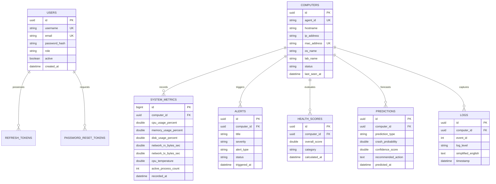

# NeuroSys – AI Powered Predictive System Monitoring Platform

[](https://www.oracle.com/java/)
[](https://spring.io/projects/spring-boot)
[](https://react.dev/)
[](https://tailwindcss.com/)
[](https://fastapi.tiangolo.com/)
[](https://www.mysql.com/)

**NeuroSys** is an enterprise-grade AI-powered predictive system monitoring platform designed for educational institutions, enterprise offices, server clusters, and organizations. The platform continuously monitors hardware metrics across computer fleets, predicts system crashes and resource exhaustion before failures occur, provides live WebSocket dashboards, translates raw Windows event logs into plain English, and delivers an intelligent AI monitoring assistant.

---

## 🌟 Architectural Overview

```
                          ┌─────────────────────────┐
                          │   Java OSHI Agent       │
                          │   (Daemon Endpoint)     │
                          └────────────┬────────────┘
                                       │ REST / JSON (Metrics every 5s)
                                       ▼
┌──────────────────────┐  STOMP / SockJS  ┌─────────────────────────┐  HTTP / REST  ┌─────────────────────────┐
│   React Dashboard    │ ◄──────────────► │  Spring Boot Backend    │ ────────────► │  Python AI Engine       │
│   (Vite + Tailwind)  │                  │  (REST, Security, JPA)  │               │  (FastAPI + Scikit)     │
└──────────────────────┘                  └────────────┬────────────┘               └─────────────────────────┘
                                                       │ JDBC
                                                       ▼
                                          ┌─────────────────────────┐
                                          │   MySQL 8 Database      │
                                          └─────────────────────────┘
```

---

## 📐 ER Diagram & Data Architecture



---

## 🚀 Key Modules & Capabilities

1. **Spring Boot Central Backend (`neurosys-backend`)**
   - Built on Java 21 & Spring Boot 3.2.
   - Spring Security 6 with stateless JWT authentication & refresh token rotation.
   - Standardized MySQL DDL schema (`V1__initial_schema.sql`) with UUID primary keys, auditing, and soft deletion (`deleted = false`).
   - STOMP WebSocket broker (`/ws-neurosys`) broadcasting live telemetry to connected dashboards.
   - 0-100 Mathematical Health Score Engine & Rule-based Alert System with Spring `JavaMailSender` support.
   - Natural Language AI Assistant context engine answering queries (*"Why is PC-12 slow?"*, *"Which computers are offline?"*).

2. **Lightweight Java OSHI Monitoring Agent (`neurosys-agent`)**
   - Lightweight background daemon powered by Operating System and Hardware Information (OSHI) library.
   - Captures CPU, RAM, Disk, Network, System Uptime, Temperatures, Top Processes, and Windows Event Logs.
   - Samples metrics every 5 seconds, auto-registers with backend, and caches data locally in a JSON queue if offline.

3. **Python AI Predictive Service (`neurosys-ai`)**
   - Built with Python 3.11+, FastAPI, Pandas, NumPy, and Scikit-learn.
   - Machine learning forecasters predicting CPU, RAM, Disk usage, and Crash Risk across 10m, 30m, and 60m horizons.
   - Classifies failure risks, identifies root cause reasons, and outputs confidence scores with recommended administrator actions.

4. **Modern React Web Dashboard (`neurosys-frontend`)**
   - React 18, Vite, Tailwind CSS v3, React Router v6, Recharts, and Lucide React.
   - 7 Dedicated Pages: **Login**, **Dashboard**, **Computers**, **Computer Details**, **Alerts**, **Analytics**, **Settings**.
   - Live WebSocket integration updating summary stats, trend charts, and alerts without page refresh.

---

## 🛠️ Quick Start Guide

### Prerequisites
- Java 21 JDK
- Node.js 20+ & npm
- Python 3.11+
- Maven 3.9+
- MySQL 8.0 or Docker Desktop

### Running via Docker Compose (Recommended)
```bash
# 1. Clone or navigate to the workspace
cd "c:/Users/Karthik/OneDrive/Desktop/Real time system monitoring with AI prediction"

# 2. Copy environment template
cp .env.example .env

# 3. Build & start all containers
docker compose up --build -d

# Access the applications:
# - Web Dashboard:  http://localhost
# - Backend API:    http://localhost:8080/api/v1
# - Swagger Docs:   http://localhost:8080/swagger-ui.html
# - AI Service API: http://localhost:8000/docs
```

---

## 📁 Repository Structure

```
.
├── README.md                      # Master Architecture & Guide
├── DEPLOYMENT.md                  # Production Deployment Manual
├── SECURITY.md                    # Security Compliance Checklist
├── docker-compose.yml             # Container Orchestration
├── .github/workflows/ci-cd.yml    # GitHub Actions Workflow
├── nginx/                         # Nginx Proxy Configurations
├── scripts/                       # Build & Deployment Scripts
├── neurosys-backend/              # Spring Boot 3 Java Server
├── neurosys-frontend/             # React 18 Web Dashboard
├── neurosys-agent/                # Java OSHI Monitoring Agent
└── neurosys-ai/                   # Python FastAPI Predictive Service
```
